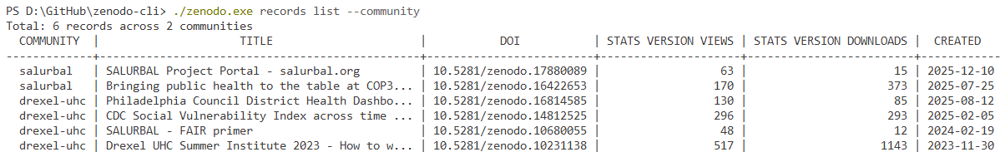

# zenodo-cli

CLI tool for managing metadata, searching records, and querying assets on Zenodo.

Wraps the Zenodo REST API for record lookup, community browsing, license search, and BI/reporting. Outputs machine-readable formats (JSON, CSV) for agent and pipeline consumption, or human-friendly tables for interactive use.

## Install

### Scoop (Windows)

```powershell
## Install Scoop if you don't have it: https://scoop.sh
# irm get.scoop.sh | iex
scoop bucket add zenodo https://github.com/ran-codes/zenodo-cli
scoop install zenodo
```

### Manual download

Download the binary for your platform from [GitHub Releases](https://github.com/ran-codes/zenodo-cli/releases), rename it to `zenodo` (or `zenodo.exe` on Windows), and add it to your PATH.

## Usage

```sh
# Store your API token (saved in OS keychain)
zenodo config set token <your-zenodo-token>

# List your records
zenodo records list

# Search published records
zenodo records search "climate data"

# Get a specific record
zenodo records get 12345

# List all versions of a record
zenodo records versions 12345

# Search communities
zenodo communities list "ecology"

# Search licenses
zenodo licenses search "creative commons"
```

### Community records with usage stats



### Output formats

Every command supports `--output json|table|csv` and `--fields` for column selection:

```sh
# JSON output (default when piped)
zenodo records list --output json

# CSV with specific fields
zenodo records list --output csv --fields id,title,doi

# Filter by community
zenodo records list --community my-org

# Auto-paginate all results
zenodo records list --community my-org --all
```

### Multiple profiles

```sh
# Set up a sandbox profile
zenodo config set profiles.sandbox.base_url https://sandbox.zenodo.org/api
zenodo config use sandbox
zenodo config set token <sandbox-token>

# Switch back
zenodo config use production

# List profiles (* = active)
zenodo config profiles
```

## Commands

| Command | Description |
|---------|-------------|
| `records list` | List your records and drafts |
| `records search <query>` | Search all published records |
| `records get <id>` | Get full record details |
| `records versions <id>` | List all versions of a record |
| `communities list [query]` | Search and list communities |
| `licenses search [query]` | Search available licenses |
| `config set <key> <value>` | Set config value (token goes to OS keychain) |
| `config get <key>` | Get a config value |
| `config use <profile>` | Switch active profile |
| `config profiles` | List all profiles |
| `version` | Print version and build info |

## Prerequisites

- A **Zenodo API token**

### Creating a Zenodo API token

1. Log in at [zenodo.org](https://zenodo.org) (or [sandbox.zenodo.org](https://sandbox.zenodo.org) for testing)
2. Go to **Applications** > **Personal access tokens** > **New token**
3. Give it a name and select the scopes you need (`deposit:write`, `deposit:actions` for future write features)
4. Copy the token and store it: `zenodo config set token <token>`

## MCP Server (Claude Code integration)

`zenodo-mcp` is a second binary that exposes Zenodo tools via the [Model Context Protocol](https://modelcontextprotocol.io/), letting Claude Code interact with Zenodo directly.

### Setup

After installing, add to your Claude Code MCP config (`.mcp.json` in your project root or `~/.claude.json`):

```json
{
  "mcpServers": {
    "zenodo": {
      "command": "zenodo-mcp"
    }
  }
}
```

The MCP server uses the same config and token as the CLI. Make sure you've already run `zenodo config set token <token>`.

### Available tools

| Tool | Description |
|------|-------------|
| `records_list` | List your own records and drafts |
| `records_search` | Search published records |
| `records_get` | Get a single record by ID |
| `records_versions` | List all versions of a record |
| `communities_list` | List your communities |
| `licenses_search` | Search available licenses |

### Environment variables

| Variable | Description |
|----------|-------------|
| `ZENODO_TOKEN` | API token (overrides keyring/config) |
| `ZENODO_PROFILE` | Config profile to use |
| `ZENODO_SANDBOX` | Set to `true` to use sandbox |

## Dependencies

| Package | Used for |
|---------|----------|
| `spf13/cobra` | CLI framework |
| `spf13/viper` | Config management |
| `zalando/go-keyring` | OS keychain for token storage |
| `olekukonko/tablewriter` | Table output formatting |
| `mattn/go-isatty` | TTY detection for output auto-switching |
| `r3labs/diff/v3` | Structural metadata diffing |
| `fatih/color` | Colored terminal output |
